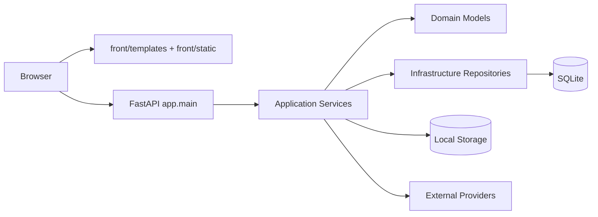
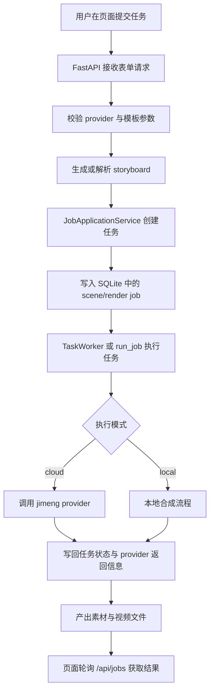
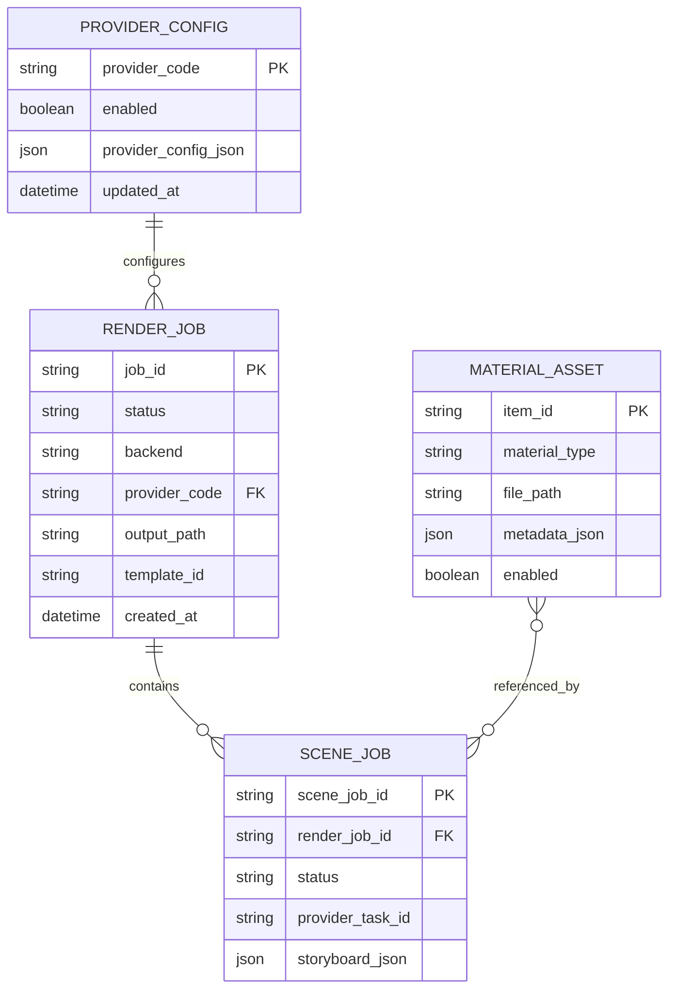

# Pet Anime Video Architecture

## 概览

当前项目采用单体部署形态：

- 浏览器通过 FastAPI 提供的页面与 API 交互
- `front/` 保存服务端模板和静态资源
- `backend/app` 负责接口、应用服务、领域模型、基础设施和 provider 调度
- SQLite 保存任务、素材和 provider 配置
- 文件系统保存上传素材、派生资源和最终输出

## 系统架构图

## 主流程图

## 组件信息

### 页面层

- `front/templates`：Jinja2 页面模板，负责首页、工作台、任务列表、配置页
- `front/static`：页面脚本与样式，负责表单交互、轮询、展示任务状态

### 接口层

- `backend/app/main.py`：FastAPI 入口，定义页面路由、健康检查、任务、素材、provider 配置等接口

### 应用服务层

- `JobApplicationService`：创建任务、查询任务、删除任务、协调任务数据写入
- `MaterialAssetService`：管理素材配置与文件写入
- `ProviderConfigService`：管理 provider 可用性、配置校验、配置持久化

### 领域模型层

- Render Job：渲染任务主记录，包含状态、provider、输出路径等信息
- Scene Job：镜头级任务记录，承接 storyboard 与渲染分解
- Material Asset：素材配置记录，关联视觉、角色、配音、音乐等文件
- Provider Config：provider 启用状态和配置快照

### 基础设施层

- `SqliteDatabase` 与各类 `Sqlite*Repository`：负责 SQLite 读写
- `LocalStorageService`：负责文件落盘与对外访问路径生成
- `AssetStore`：负责资源索引和最近资源查询

### 外部依赖层

- Jimeng provider：当前云端任务主 provider
- 本地文件系统：保存上传文件、产物、数据库文件
- SQLite：任务、素材、provider 配置持久化存储

## ER 图

## 配置与运行说明

- 正式配置入口为根目录 `config.yaml`
- 环境变量覆盖逻辑仍保留在代码中，但只作为兼容机制，不作为项目主配置方案
- Docker 与本地运行都应优先围绕 `config.yaml` 组织

## 产物目录

- `uploads/`：上传与素材文件
- `outputs/`：生成的视频文件
- `.data/`：SQLite 数据文件
- `front/htmlcov/`：测试覆盖率 HTML 产物
